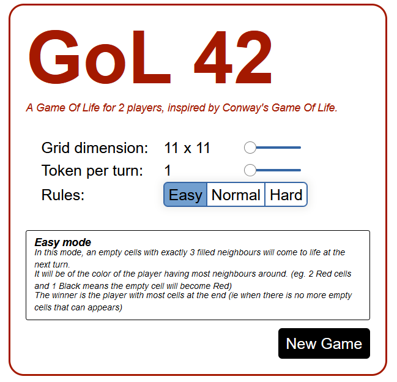
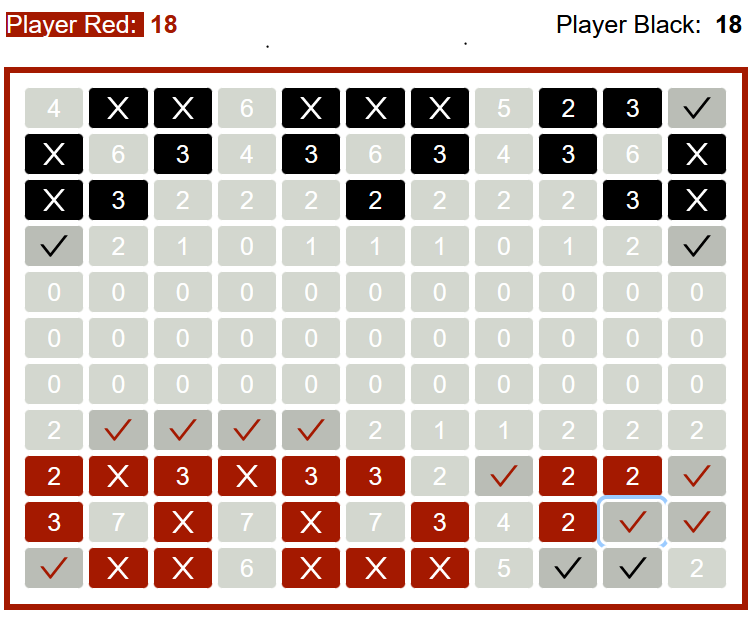
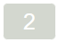

# GoL 42

## What is Conway's Game Of Life ?

From [wikipedia](https://en.wikipedia.org/wiki/Conway%27s_Game_of_Life) :

_The Game of Life, also known simply as Life, is a cellular automaton devised by the British mathematician John Horton Conway in 1970.It is a **zero-player game**, meaning that its evolution is determined by its **initial state**, requiring no further input_

In a nutshell (still taken from wikipedia) :

    1- Any live cell with two or three live neighbours survives.
    2- Any dead cell with three live neighbours becomes a live cell.
    3- All other live cells die in the next generation. Similarly, all other dead cells stay dead.

## What is GoL42 ?
This is a attempt to make a Game of Life for 2 people, playing against each others.

Each player (Red, or Black) will place on a board one (or several cells) at each turn, and then the rules of the game of life will be applied, to compute the next generation.

Red players starts.

## How to play ?

The game runs in a browser - you just need javascript enabled.

## Starting a new game
The app is designed to allow settings/rules to experiment and see which set-up is the more balanced / more fun to play.

You can select :

1- The board size, n x n
2- The number of tokens per player per turn (ie the number of new cells a player can put on the board)
3- The difficulty Easy/Normal/Hard - which effectively correspond to 3 different types of game

The game screen looks as follow :

Each square represent a cell.

| Cells | Description |
| ----- | ----------- |
|              | A live cell with 3 neighbours, belonging to the red player. |
|                  | A live red cell that will die the next turn.                |
|                | A live black cell that will die the next turn.              |
|        | A dead cell with 2 live neighbours.                         |
|    | A dead cell with 3 neighbours, of which at least 2 are red. It will become a red live cell next turn.  |
|  | A dead cell with 3 neighbours, of which at least 2 are red. It will become a black live cell next turn.|

### Difficulty Easy
This mode implements only the second rule of the Game Of Life :

`  2- Any dead cell with three live neighbours becomes a live cell.`

The goal for each player is to have the most cells with its color.
The end of the game is when no dead cell has less than 4 neighbours (ie no more cell can become alive).

### Difficulty Normal
This mode implements the first and third rules of the Game Of Life :

`  1- Any live cell with two or three live neighbours survives.`
`  3- All other live cells die in the next generation. Similarly, all other dead cells stay dead.`

The goal for each player is to make the opponent's cells disappear.

The end of the game is reached when a new generation will leave a player with no cells. No new cells (except the ones added at each turn by players) can spawn.

### Difficulty Hard

This mode implements all the rules of the Game Of Life. 

The goal for each player is to make the opponent's cells disappear.

The end of the game is reached when a new generation will leave a player with no cells.

This mode is difficult as predicting the next board is really challenging and table can turn easily.

## Implementation

The game is implemented in Elm and compiles to javascript. So just a normal browser with javascript enabled allows 2 people to play.

`elm make src/GoL/* src/State/* src/Update/* src/View/* src/Main.elm`

No IA at the moment ... Let's see if this is fun to play first :) 